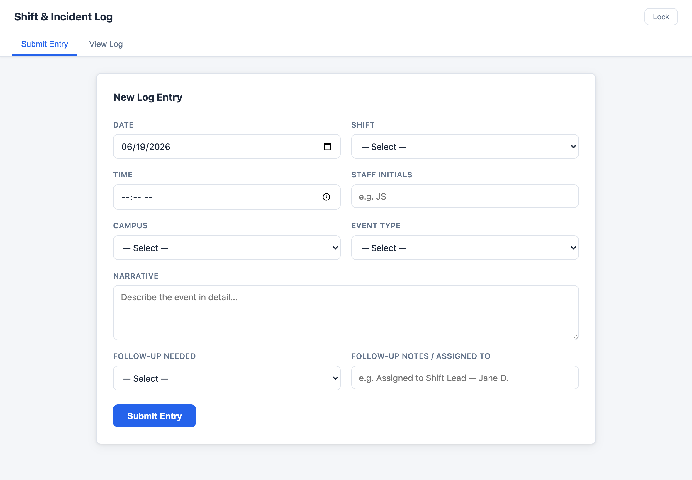
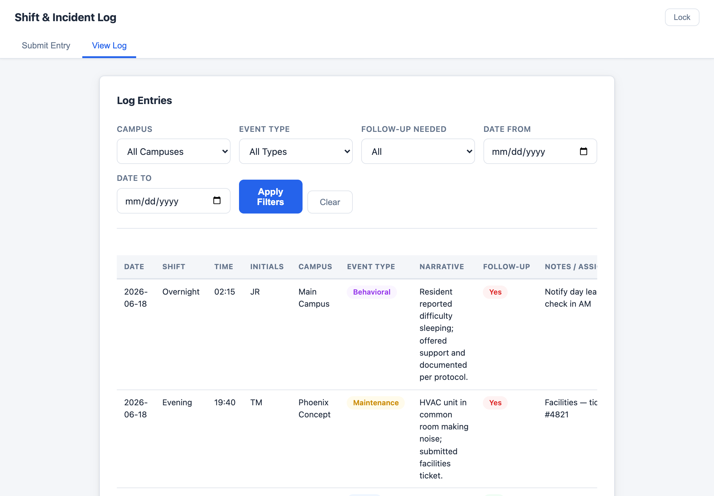
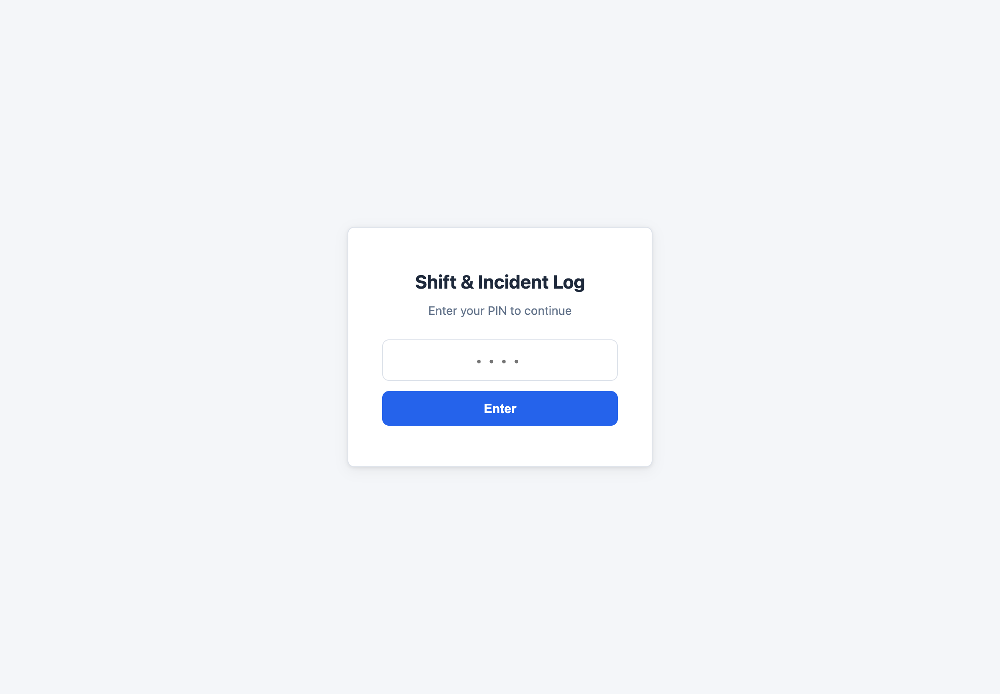

# Shift & Incident Log

A web-based shift and incident logging tool built for a multi-campus behavioral health facility. Staff submit entries from any device via a clean PIN-protected form; supervisors and leads review the full log with filtering in real time.

[](https://simonsealey.github.io/Shift-Incident-Log/)


> **Note:** This is a structural prototype. No real client or patient data is used — all sample entries are fictional.

**🔗 Live demo:** https://simonsealey.github.io/Shift-Incident-Log/ &nbsp;(PIN: `1474`)

---

## Screenshots

### Submit an entry


### Review the log (filterable)


### Secure access


---

## Features

- **PIN-protected access** shared among staff
- **Submit from any device** — phone, tablet, or desktop
- **Centralized storage** in a hosted Postgres database (Supabase)
- **Filterable log view** by Campus, Event Type, Follow-Up Needed, and Date range
- **Color-coded badges** for event type and follow-up status
- **Newest entries first** for fast shift handoffs
- **Row Level Security** — public users can add and view entries, but cannot delete them
- **Fully responsive** layout

## Fields Logged

| Field | Type |
|---|---|
| Date | Date picker |
| Shift | Dropdown — Day / Evening / Overnight |
| Time | Time picker |
| Staff Initials | Text |
| Campus | Dropdown — Main Campus / Phoenix Concept / Stepping Stone |
| Event Type | Dropdown — Incident / Medical / Behavioral / Maintenance / Visitor / Other |
| Narrative | Free text |
| Follow-Up Needed | Dropdown — Yes / No |
| Follow-Up Notes / Assigned To | Text |

---

## Tech Stack

| Layer | Tool |
|---|---|
| Frontend | HTML, CSS, Vanilla JS |
| Backend / Database | Supabase (hosted Postgres + auto REST API) |
| Hosting | GitHub Pages |

---

## Setup Instructions

### 1. Create a Supabase project

1. Go to [supabase.com](https://supabase.com) and sign up (free tier is fine).
2. Click **New project**, give it a name, and set a database password.
3. Wait ~2 minutes for the project to finish provisioning.

### 2. Create the table

1. In the Supabase dashboard, open **SQL Editor → New query**.
2. Paste the contents of [`supabase_setup.sql`](supabase_setup.sql) from this repo.
3. Click **Run**. This creates the `shift_log` table and its access policies.

### 3. Get your API credentials

1. In the dashboard, go to **Project Settings → API**.
2. Copy the **Project URL** and the **anon / public** key.

### 4. Connect the frontend

1. Open `script.js`.
2. Fill in the two values at the top:
   ```js
   const SUPABASE_URL      = "https://YOUR-PROJECT.supabase.co";
   const SUPABASE_ANON_KEY = "your-anon-public-key";
   ```
3. Save the file.

### 5. Host on GitHub Pages

1. Push this repo to GitHub.
2. Go to **Settings → Pages**.
3. Set source to **main branch / root**.
4. Your app will be live at:
   ```
   https://<your-username>.github.io/shift-incident-log/
   ```
5. Share that URL with your staff at each campus.

> You can also view and export all entries directly in the Supabase dashboard
> under **Table Editor → shift_log** — it filters and exports to CSV like a spreadsheet.

---

## Security Notes

- The PIN (`1474`) is stored client-side in `script.js`. It keeps the page off casual/search-engine access; for production, replace it with real authentication.
- The Supabase **anon key is meant to be public** — it is safe to ship in the frontend. Access is governed by Row Level Security policies (see `supabase_setup.sql`), not by hiding the key.
- No patient or client data should ever be entered into this prototype.

---

## Project Context

Built as a portfolio project demonstrating:
- Full-stack app: Vanilla JS frontend + Postgres backend via Supabase
- REST data access with Row Level Security policies
- Responsive, accessible form design
- Real-world use case: multi-campus healthcare operations tooling
